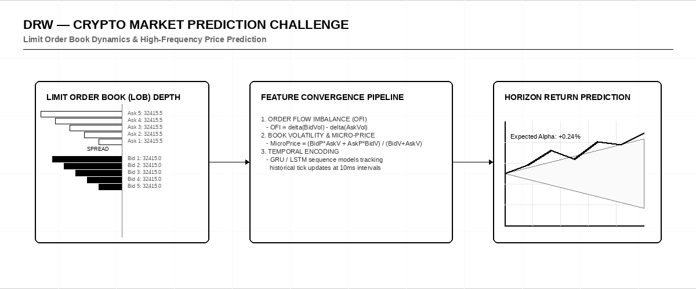
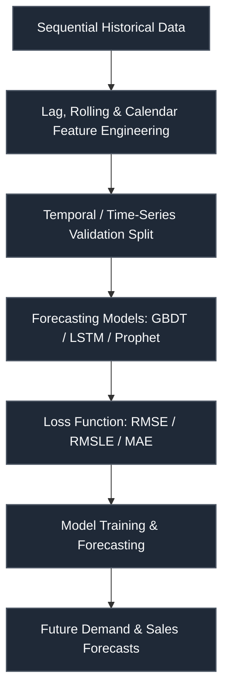

# DRW — Crypto Market Prediction Challenge

 

> **Host:** [`DRW Trading`]  
> **Platform Link:** [Kaggle Competition](https://www.kaggle.com/competitions/drw-crypto-market-prediction)  
> **Dataset Link:** [Kaggle Dataset](https://www.kaggle.com/competitions/drw-crypto-market-prediction/data)  
> **Domain:** `Crypto & Financial Markets`

## Overview

This repository contains the developmental workspace and notebooks for the **DRW — Crypto Market Prediction Challenge** project. The primary focus of this project is in the domain of **Crypto & Financial Markets** on DRW Trading. The codebase represents an iterative implementation of machine learning pipelines, structured to process datasets, train models, and validate predictions.

### Project Context

plt.figure(figsize=(10, 170)). plt.barh(drw['columns'][drw['corrulation'] > -1], drw['corrulation'][drw['corrulation'] > -1]). plt.show().

### Technical Methodology & Implementation

The codebase features a total of 119 cells across 18 notebook(s). The system implements several key architectural elements:
- **Core Classes**: Custom object-oriented structures are defined to manage state and logic, including: `model_infrence`.
- **Key Algorithms & Utilities**: Procedural helpers and utilities facilitate operations, notably: `__new__`, `manual_ensemble`.
- **Training & Optimization**: Includes cross-validation strategy for stable predictions.

## System Architecture

## Notebook Architecture

### Preprocessing & EDA

| Notebook / Script | Type | Versions | Average Size | Core Stack / Techniques |
| :--- | :--- | :--- | :--- | :--- |
| **EDA_and_Visualization** | Multi-Version Script | [v1](./Preprocessing%20%26%20EDA/EDA_and_Visualization/v1.ipynb), [v2](./Preprocessing%20%26%20EDA/EDA_and_Visualization/v2.ipynb), [v3](./Preprocessing%20%26%20EDA/EDA_and_Visualization/v3.ipynb), [v4](./Preprocessing%20%26%20EDA/EDA_and_Visualization/v4.ipynb) | 856 KB | Requests API |
| **LightGBM_LightGBM_XGBoost_XGBoost_CatBoost_EDA_and_Visualization** | Multi-Version Script | [v1](./Preprocessing%20%26%20EDA/LightGBM_LightGBM_XGBoost_XGBoost_CatBoost_EDA_and_Visualization/v1.ipynb), [v2](./Preprocessing%20%26%20EDA/LightGBM_LightGBM_XGBoost_XGBoost_CatBoost_EDA_and_Visualization/v2.ipynb), [v3](./Preprocessing%20%26%20EDA/LightGBM_LightGBM_XGBoost_XGBoost_CatBoost_EDA_and_Visualization/v3.ipynb) | 1.2 MB | CatBoost, LightGBM, Requests API, Scikit-Learn, XGBoost |
| **LightGBM_LightGBM_XGBoost_XGBoost_CatBoost_EDA_and_Visualization_2** | Multi-Version Script | [v1](./Preprocessing%20%26%20EDA/LightGBM_LightGBM_XGBoost_XGBoost_CatBoost_EDA_and_Visualization_2/v1.ipynb), [v2](./Preprocessing%20%26%20EDA/LightGBM_LightGBM_XGBoost_XGBoost_CatBoost_EDA_and_Visualization_2/v2.ipynb) | 105 KB | CatBoost, LightGBM, Requests API, Scikit-Learn, XGBoost |
| **LightGBM_LightGBM_XGBoost_XGBoost_CatBoost_SVM_DecisionTree_EDA_and_Visualization** | Multi-Version Script | [v1](./Preprocessing%20%26%20EDA/LightGBM_LightGBM_XGBoost_XGBoost_CatBoost_SVM_DecisionTree_EDA_and_Visualization/v1.ipynb), [v2](./Preprocessing%20%26%20EDA/LightGBM_LightGBM_XGBoost_XGBoost_CatBoost_SVM_DecisionTree_EDA_and_Visualization/v2.ipynb), [v3](./Preprocessing%20%26%20EDA/LightGBM_LightGBM_XGBoost_XGBoost_CatBoost_SVM_DecisionTree_EDA_and_Visualization/v3.ipynb) | 42 KB | CatBoost, LightGBM, Requests API, Scikit-Learn, XGBoost |

### Training

| Notebook / Script | Type | Versions | Average Size | Core Stack / Techniques |
| :--- | :--- | :--- | :--- | :--- |
| **LightGBM_LightGBM_XGBoost_XGBoost_CatBoost_SVM_DecisionTree_Training** | Multi-Version Script | [v1](./Training/LightGBM_LightGBM_XGBoost_XGBoost_CatBoost_SVM_DecisionTree_Training/v1.ipynb), [v2](./Training/LightGBM_LightGBM_XGBoost_XGBoost_CatBoost_SVM_DecisionTree_Training/v2.ipynb), [v3](./Training/LightGBM_LightGBM_XGBoost_XGBoost_CatBoost_SVM_DecisionTree_Training/v3.ipynb), [v4](./Training/LightGBM_LightGBM_XGBoost_XGBoost_CatBoost_SVM_DecisionTree_Training/v4.ipynb), [v5](./Training/LightGBM_LightGBM_XGBoost_XGBoost_CatBoost_SVM_DecisionTree_Training/v5.ipynb), [v6](./Training/LightGBM_LightGBM_XGBoost_XGBoost_CatBoost_SVM_DecisionTree_Training/v6.ipynb) | 12 KB | CatBoost, LightGBM, Requests API, Scikit-Learn, XGBoost |

## Navigation Guidelines

> **Stage Guidelines**
>
- **EDA & Preprocessing**: Verify data loaders and inspect class distributions before model design.
- **Training & Validation**: Check training runs, loss curves, and model validation scores to evaluate performance.
- **Inference & Ensembling**: Run predictions on testing files and verify submission formatting.

---

> "In the volatile market, greed and panic are the dual engines of chaos."
>
> — **Vigneshwaran S**
